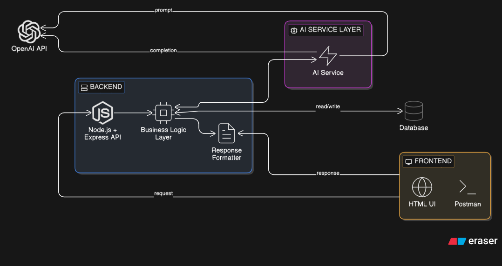
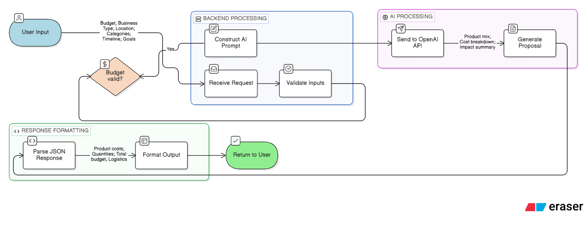
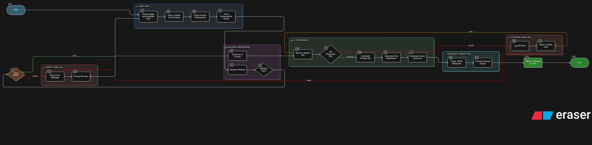

AI Product Automation System
Overview
This project is an AI-powered backend system built using Node.js and OpenAI API. It automates key business processes for a sustainable e-commerce platform, including product classification and B2B proposal generation.

The system accepts user input through REST APIs, processes it using AI models, and returns structured JSON outputs. The architecture is designed to ensure modularity, scalability, and clean separation between business logic and AI services.

Architecture Overview

Key Components:

Frontend Layer: Handles user input (HTML UI / Postman)
API Layer: Express endpoints for handling requests
Business Logic Layer: Validations and processing
AI Layer: Prompt-based interaction with OpenAI
Response Layer: Formats structured JSON output

MODULE 1 ARCHITECTURE PROMPT (Tag Generator)

Automatically assigns product category
Suggests sub-category
Generates SEO tags (5–10)
Provides sustainability filters
Returns structured JSON output

How it works:
User input → Backend → AI prompt → OpenAI → JSON response

MODULE 2 ARCHITECTURE PROMPT (Proposal Generator)

Suggests sustainable product mix
Allocates budget within constraints
Generates cost breakdown
Provides impact summary
Returns structured JSON

How it works:
User input → Budget validation → AI prompt → OpenAI → JSON output

MODULE 3 ARCHITECTURE PROMPT (Impact Reporting)
User / Order System
        ↓
Backend API (Node.js)
        ↓
Input Validation
        ↓
Impact Calculation Engine
        ↓
 ┌───────────────┬────────────────┐
 ↓               ↓                ↓
Plastic Saved   Carbon Avoided   Local Impact
(Calculation)   (Calculation)    (Summary)
        ↓
Impact Aggregator
        ↓
Database Storage (Optional)
        ↓
Response Formatter
        ↓
User Output (JSON Report)

Steps:
1. User order data received
2. Backend processes quantity and product type
3. Apply predefined formulas for:
   - Plastic saved
   - Carbon avoided
4. Generate impact summary
5. Store in database
6. Return report to user

Requirements:
- Highlight that no AI is used
- Show calculation engine
- Show data flow clearly

MODULE 4 ARCHITECTURE PROMPT (Chatbot)

User (WhatsApp)
        ↓
WhatsApp API (Twilio)
        ↓
Webhook Endpoint (Node.js Backend)
        ↓
Request Handler
        ↓
Intent Detection (Rule-based / AI)
        ↓
 ┌───────────────┬────────────────┐
 ↓               ↓                ↓
Order Query   FAQ Handling   Escalation Logic
 ↓               ↓                ↓
Database       Static Data     Admin Notification
        ↓
Response Generator
        ↓
Send Response via WhatsApp API
        ↓
User
Components:
1. User (WhatsApp)
2. WhatsApp API (Twilio)
3. Backend Webhook (Node.js)
4. Intent Detection (rule-based or AI)
5. Database (orders, FAQs)
6. Response generator

Flow:
User → WhatsApp → Webhook → Backend → Intent Detection → Database → Response → User

Prompt Design
🔹 Module 1 Prompt
You are an AI system.

STRICT RULES:
- Return ONLY valid JSON
- No explanation
- No markdown

Product: {product_name}
Description: {description}

Return format:
{
  "category": "",
  "sub_category": "",
  "tags": [],
  "sustainability_filters": []
}
🔹 Module 2 Prompt
You are an AI system.

STRICT RULES:
- Return ONLY valid JSON
- No explanation
- No markdown

Generate a sustainable B2B proposal.

Budget: {budget}
Business Type: {business_type}

Return format:
{
  "products": [],
  "budget_used": 0,
  "impact_summary": "",
  "cost_breakdown": {}
}

Tech Stack

Node.js
Express.js
OpenAI API
Postman (testing)
HTML (frontend)

▶️ How to Run

Install dependencies:
    npm install
Add environment variable:
    OPENAI_API_KEY=your_api_key
Start server:
    node server.js

Features

AI-powered automation
Structured JSON outputs
Prompt engineering
Logging and error handling
Modular architecture

Future Improvements

Database integration (MongoDB)
React frontend
Real WhatsApp API integration
AI fine-tuning for better accuracy